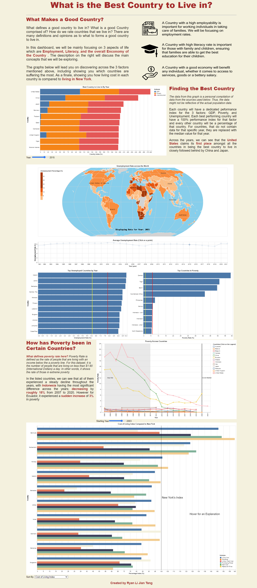
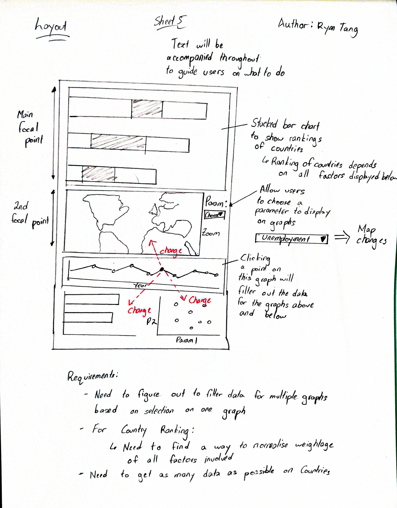

# Table of Contents:

- [Table of Contents:](#table-of-contents)
  - [What is the Best Country To live in?](#what-is-the-best-country-to-live-in)
  - [Tasks Performed and Skill used](#tasks-performed-and-skill-used)
      - [Design Planning](#design-planning)
      - [Web Scraping + Data Cleaning (Python + Pandas)](#web-scraping--data-cleaning-python--pandas)
      - [Creation of Final Averaged Graph (Python + Pandas)](#creation-of-final-averaged-graph-python--pandas)
      - [Creation of Graphs (Vega-Lite)](#creation-of-graphs-vega-lite)
      - [Displaying on Webpage (HTML + CSS)](#displaying-on-webpage-html--css)
  - [Acknowledgements](#acknowledgements)
    - [Data:](#data)

 

## What is the Best Country To live in? 
Website Link: https://rytang.github.io/Country-Project/

One of the concepts that I was so curious in was what defines a Good Country to live in? Is it the security of a job, the economy of the country or the benifits that a country provides: Health Care, Luxury Activities, or environnent.

Therefore this is what this project attempts to solve. It attempts to display all these metrics together to form an insight for those that are interested.

 

## Tasks Performed and Skill used

#### Design Planning
To ensure that I had a clear head in how the layout will be, or how it will cater to the user experience, I adopted the 5 design sheets practice which involves iterations upon iterations of different ideas and recognising what works, thereby, including this in the final design of the work. An example of one design sheet is seen below.

#### Web Scraping + Data Cleaning (Python + Pandas)
Due to the data coming in many different formats, the data has to be cleansed and adjusted to ensure compatability between different data. This includes dealing with non-existent data or different namings of countries throughout all dataframes. This extends to finding out how to deal with filling in data for averages

#### Creation of Final Averaged Graph (Python + Pandas)
To create a comparison to find what is the best country according to my definitions. I had to make a compilation of all the different metrics to combine the data, however, this data was not easily available. Therefore, I performed an almagamation of the different data, where I encountered an issue where certain countries do not have data available for a certain metric. However, it does not make sense to take them out of the race. Therefore, I allowed these countries to take an average value from the other countries temporarily until they are able to grab the data needed.

#### Creation of Graphs (Vega-Lite)
The creation of the graphs were made using Vega-Lite, where their code may be found in the folder above under ***"js"***. Each graph has been made while following closely to the idea of *"What am I trying to show the Audience?"*

#### Displaying on Webpage (HTML + CSS)
Finally displaying all this hardwork is then done by creating a webpage which is now hosted on Github for all to see. This is done by coding in HTML and CSS.

## Acknowledgements
### Data:
*The Data used in this visualisation is mainly from Kaggle.*

Hore, A. (2022, May). Cost of Living Index 2022. Retrieved from Kaggle: https://www.kaggle.com/datasets/ankanhore545/cost-of-living-index-2022

Max Roser, E. O.-O. (2019, March 27). Global Extreme Poverty. Retrieved from OurWorldInData: https://ourworldindata.org/extreme-poverty#extreme-poverty-the-share-of-people-living-on-less-than-1-90-int-per-day

Moth. (2022, July). GDP By Country 1999 - 2022. Retrieved from Kaggle: https://www.kaggle.com/datasets/alejopaullier/-gdp-by-country-1999-2022

Pant, A. (2022, September). Unemployment dataset. Retrieved from Kaggle: https://www.kaggle.com/datasets/pantanjali/unemployment-dataset

Pant, M. (2022, September). World Economic Data. Retrieved from Kaggle: https://www.kaggle.com/datasets/madhurpant/world-economic-data?select=cost_of_living.csv

Ullah, N. (2017). Youth, Unemployment, GDP and Literacy Percentage. Retrieved from Kaggle: https://www.kaggle.com/datasets/niyamatalmass/youth-unemployment-gdp-and-literacy-percentage?select=unemployment.csv
